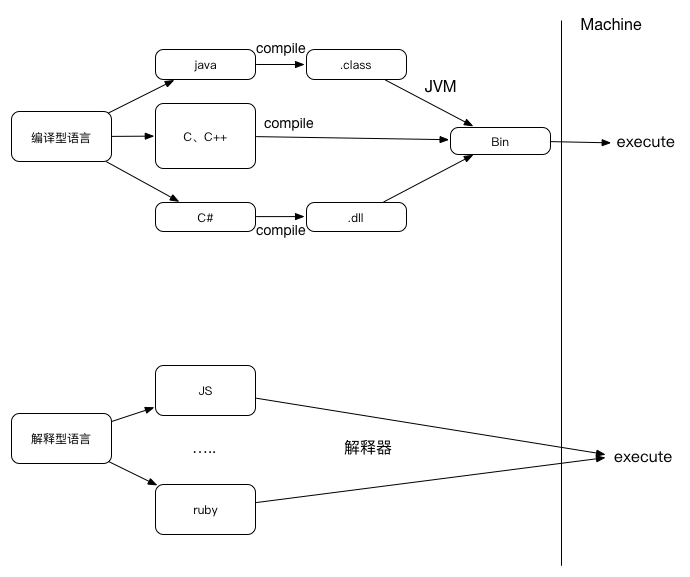
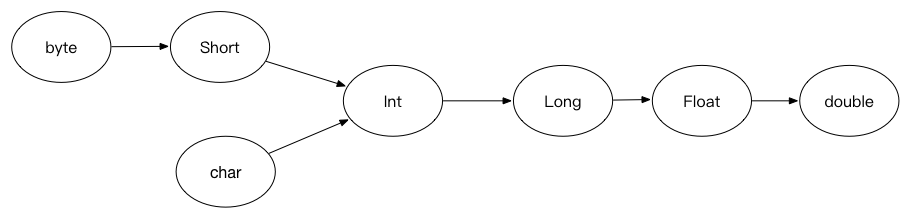
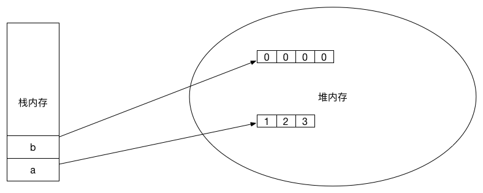
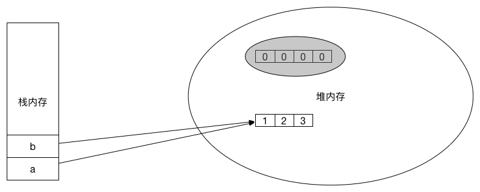
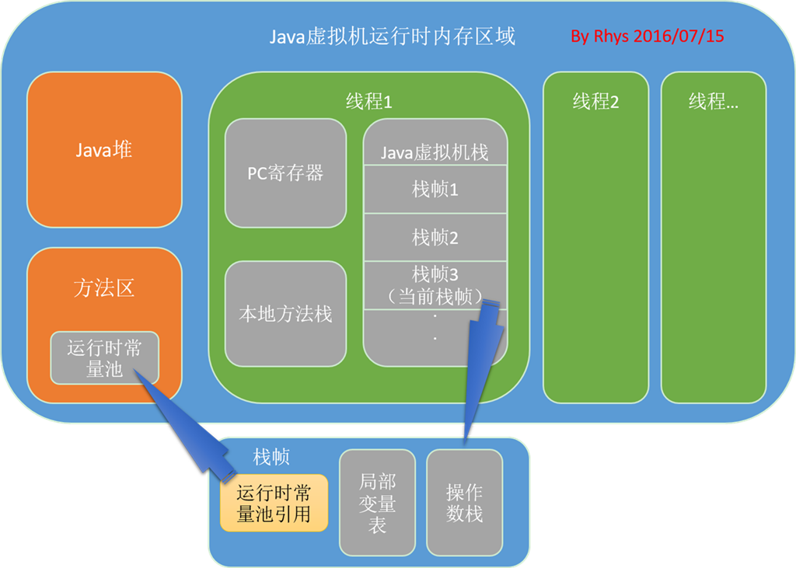
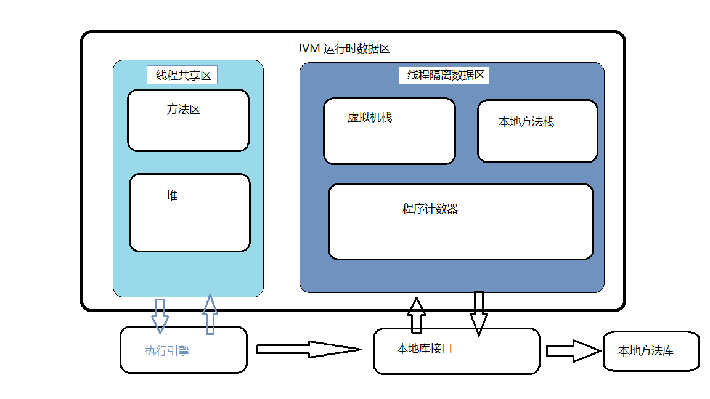
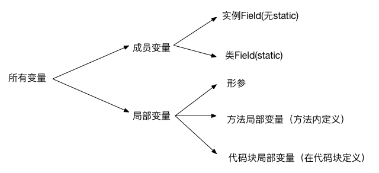

# JAVA学习笔记

## 编译型语言和解释型语言
----
**编译型语言**指使用专门编译器，针对特定平台（操作系统）将源代码一次性翻译成可被该平台硬件执行的机器码。由于编译语言是一次性编译成机器码，所以可以脱离开发环境独立运行，运行起来效率高，但是跨平台性低。常用的：JAVA、C、C++、Pascal等语言（编译语言中java和c其实也有区别）。

**解释型语言**指使用通用的解释器，根据平台的不同将源代码直接解释成机器语言让机器立即执行（并不会产生中间文件，而是直接执行！），解释器是通用的，从而实现解释型语言的跨平台性。解释型语言相当于把编译型语言中的编译和解释过程混合到一起同时完成。

如图：



可以看到**编译型语言**有两种：**第一种**如C++，直接编译成机器可以执行的二进制文件给机器执行；**第二种**如java，先编译成.class文件然后通过JVM解释成二进制文件给机器执行（这也是为什么java比C++要慢一些，因为多了JVM解释的一步，但java也因此可以跨平台）。**解释型语言**通过解释器直接生成机器代码让机器立即执行，因此解释型语言不能脱离解释器独立运行，但是因为解释器使解释型语言可以跨平台运行；可以认为解释型语言每一次运行都会编译一次，因为解释型语言不会产生中间文件（如java .class文件等），而编译型语言可以一次编译多次执行，这也导致解释型语言运行效率比编译型语言要低很多。（现在已经有很多方案来对解释型语言的运行进行优化）

## JAVA是强类型语言
----
java语言是一种强类型语言，即每一个变量和每一个表达式都有一个在编译时就确定的类型。每一个变量都必须先声明类型，才能使用。变量的类型限制了变量所能被赋予的值，限制了这些变量可进行的操作。

java支持数据类型分为两类：

* 基本数据类型：

	* **整数类型**
	* **字符类型**
	* **浮点类型**
	* **布尔类型**

* 引用类型：类、接口、数组类型，引用类型变量其实就是**指针**。（null 是一种特殊的引用类型）

### 字符类型和整数类型
-
* 字符常量必须用单引号，String必须用双引号。
* char类型一共可以表示65535个字符，所以char值可以直接转化为整数类型，范围是0~65535。将一个char变量直接赋予一个int变量，int变量显示的是这个char变量的内容在**字符表中**的值。
* 可以给char变量直接赋予0~65535间的int值，会自动转化成某一个字符，原理跟上面相同。（但不能给char变量直接赋予int变量）

### 浮点类型
-
* float（单精度） 占4字节32位， double（双精度） 占8字节64位。double精度更高，占内存更高。 float类型**默认使用double类型**，要使用单精度float后面需要加f或(float a=5.12f)。
* 只有浮点数才能用科学计数法
* 只有浮点数除以0才能得到正负无穷大。

### 基本类型转换
-
#### 自动类型转换

java中基本类型的自动转化图如下：



	注意：当将任何基本类型的与字符串进行连接运算时，基本类型值将自动转换为字符串类型。

#### 强制类型转换

强制类型转换就是上图的逆转换，因此必须要强制转换。用法:`targetType value1=(targetType)value2`

通常字符串类型不能直接转化为基本数据类型，但是通过基本类型的包装类可以实现转换，(java 8种基本类都提供了包装类)比如：

```
String a="45";
int iValue=Integer.parseInt(a);

```
#### 表达式类型自动提升

当一个表达式包含多个基本类型时，**整个表达式的数据类型将自动提升为最高等级的数据类型**。除法亦然，如果最高等级是int，除出来有小数则小数部分自动被去除。

## 流程控制与数组
----
### Switch分支语句
-
需要注意的一点是case 中可以没有break。switch 语句**只做出一次判断**，因此如果匹配的case没有break就会顺序执行后面case语句中的模块，直到遇到break才会停止。

### for循环语句
-
for循环语句`for(初始化语句;条件判断语句;迭代语句)`,其中只有两个分号是必要的，如果是`for(;;)`则死循环（默认一直为true）。可以看到：

```
int count =2
for(;count<10;){
	...
	count++;
}
```

这种写法就跟while循环非常相像。

### 数组
-
数组也是一种类型，它要求数组中所有元素都是相同的类型（基本类型或引用类型都可以）。定义数组：`type[] name`或`type name[]`推荐使用第一种。

**数组初始化**：数组初始化就是为数组 *分配空间* 和 *赋予初始值*，两者 **缺一不可**！初始化分为两种：

* **静态初始化**：由程序员显示指定初始值`arrayname=new type[]{
 element1,element2,...}`
 
* **动态初始化**：只指定数组的长度，由系统为每个元素设定初始值`arrayname=new type[3]`

	* byte/short/int/long初始为0
	* float/double初始为0.0
	* char为 '\u0000'
	* boolean 为 false
	* 引用类型为 null、

java中其实没有二维数组，虽然可以`type[][] name`来定义，但是实质也是一个一维数组，只不过一维数组中的元素也是引用而已。

### foreach循环
-
java 5后的一种新循环，用来**自动迭代遍历数组或者集合**，用法类似：`for(book:books){}`。循环会自动将每一个books数组的元素赋值给book并执行一次循环。  

	注意，book 只是一个临时变量，所以改变book值并不能影响数组中的值。

## 堆内存和栈内存
----
### 什么是堆和栈
-
当在一段代码块定义一个变量时，Java就在栈中为这个变量分配内存空间，当超过变量的作用域后，Java会自动释放掉为该变量所分配的内存空间，该内存空间可以立即被另作他用。**所以说栈是一个临时的为一个方法服务的内存空间，里面存放方法的参数或者引用对象的变量**   
堆内存用来存放由new创建的对象和数组。在堆中分配的内存，由Java虚拟机的自动垃圾回收器来管理。**堆内存是一个相对稳定的内存空间，为整个程序服务。在堆内存中的对象，只有当没有任何引用变量引用它时，它才会被垃圾回收机制回收。**

### 一个堆栈说明实例：
-
代码：

```
public class test {
	public static void main(String[] args) {
		int[] a={1,2,3};//引用变量a指向一个新的数组
		int[] b=new int[4];//引用变量b指向一个新的数组
		System.out.println("b数组长度："+b.length);
		b=a;//将b指向的数组改到与a相同
		System.out.println("新的b数组长度"+b.length);
	}
}
```   

输出：

```
b数组长度：4
新的b数组长度3
[Finished in 0.8s]
```

改变的并不是引用变量b之前指向数组的长度，而是b指向的对象。**定义并初始化一个数组后，内存中分配了两个空间，一个用于存放数组的引用变量（即栈内存），一个用于存放数组本身（堆内存）**
下面是运行时内存示意图：


刚创建时，b指向第一个数组，a指向第二个数组。



`b=a`之后，引用变量b指向第二个数组，第一个数组没有引用对象引用它，变成了垃圾，等待垃圾回收站来回收它。

	注意：如果初始化了一个引用数组，引用数组中的元素都是引用，那么这个引用数组实体还是存储在**堆内存中的**，引用它的变量存储在栈内存中！

放两张JVM运行时内存图：




## 面向对象
-------------------------
### 定义类
-
* 常见的可以定义3个：构造器、Field(成员变量)、方法。
  * 构造器：创建对象的根本途径，如果不设置java会默认一个构造器。构造器实际上是有返回值的，返回的值就是该类的一个实例。构造器都是通过`new`来调用。

* **修饰符**：`public/protected/private  static final/abstract`,其中`final 和 abstract`互斥，他们可以和`static`组合起来修饰方法。


* **static修饰符**：该关键字可以修饰Field和方法，static修饰的表示它属于这个类本身，而不属于该类的单个实例，例如：`Integer.toString(int a)`,这个toString(int i)方法就是static方法，由该类直接调用而不是Integer类的某一个实例调用。（当然Integer实例也有toString()方法，不过注意：Integer的非static方法没有参数！）  
  不使用static修饰则表示该方法或成员变量属于单个实例。**java中用static修饰的Field可以看成一个全局变量或者方法，作用是在一个类里面实现变量的内容或者方法的共享。static成员不能访问非static成员**


		注意：类的方法和Field都是可以通过类的实例来进行访问的！！！


* 对象的**this引用**：this关键字总是指向调用该方法的对象。根据this位置不同，this作为对象的默认引用有两种形式：
  * 构造器中，引用该构造器正在初始化的对象
  * 在方法中，引用调用该方法的对象（主要作用于一个类中两个不同的方法互相使用，this也可以省略）
`注意：在static修饰的方法中无法使用this关键字，因为static 方法并没有一个确定的实例对象。`
`所以，要在static方法中使用这个类的普通方法，只能new一个对象来调用其中的普通方法。`


### 参数调用
-
* 传入参数是基本类型参数：  
  实参的值不会受方法内部形参改变的影响，因为传入的形参实际上是在方法栈中对实参进行了复制，因此实参是不会改变的。
* 传入参数是引用类型参数：  
  实参的值会所指向的对象会受影响，实参本身指向对象这件事是不会改变的，改变的是指向的这个对象的内容，因为方法内的形参也指向了这个对象，因此对这个对象的修改是有效的。

```
注意：基本数据类型的数值是直接保存在main栈里面的，复制后也是直接保存在方法栈里面的，不存在引用关系，所以不会改变；而引用数据类型本身就是一个指针，因此形参也是指向实参指向的位置，形参复制的仅仅是实参指向目标的引用，所以方法内对形参指向对象的修改实际上也是对实参修改对象的修改。
```

### 形参个数可变方法
-
在java 1.5之后允许定义形参个数可变的方法，在一个形参后面加‘...'三点，表面可以接受多个数值，多个数值将会被当成数组传入方法：

```
 public void test(int i, String...books){}//books将作为数组传入方法中
```
与`public void test(int i,String[] books){}`的区别在于调用方法的时候前一种方法会更简便一些，后一种方法必须要新创建一个字符串数组。

### 方法重载
-
java中确定一个方法有三个要素：

* 调用者，方法所属者，既可以是类也可以是对象
* 方法名，方法的表示符
* 形参列表，调用方法是，系统会根据传入的实参列表匹配

**只有当**一个方法调用者和方法名都相同，形参列表不同时才能是方法重载。（？！对于方法的重载返回值必须相同，形参列表必须不同，描述符如static,public 貌似可以不同)

### 成员变量和局部变量
-


**成员变量**随其所属的类或者实例存在而存在。类Field访问`类.类Field`,实例Field访问`实例.实例Field`,类Field也可以通过实例访问，不过它不属于实例，而属于类`实例.类Field`。

类在第一次加载过之后其类Field就会存储于堆内存当中，当又有一个变量new 了这个类，这个类不会重新加载，其中的类Field也不会发生改变。

**局部变量**在定义的时候并不会分配内存，只有显示地初始化赋值之后才会分配内存。局部变量存放在方法栈中，如果是基本类型数据则跟局部变量一起存储在方法栈；如果是引用类型数据，则方法栈中这个变量存储的是地址。

栈内存中的变量无需垃圾回收，往往是随着方法或代码块的结束而结束。

### 封装和隐藏
-
#### 封装

面向对象的三大特性之一（+继承和多态），封装指**将对象的状态信息隐藏在内部，不允许外部程序直接访问对象内部信息，只能通过对象所提供的方法来实现对对象内部信息的访问和操作**。

封装的目的：将对象的Field和内部实现细节隐藏起来；将方法暴露出来，让方法来对对象进行访问和控制。

好处：

* 隐藏类的细节实现
* 让使用者只能通过方法来访问类，从而在方法中对访问操作进行控制，避免不合法的访问
* 进行数据检查，保证对象信息完整
* 便于维护

实现方法：java访问控制符

#### 访问控制符

三个控制符：private public protected, 以及不加任何符号的控制级别，一共4个级别，由小到大为：
`privrate-->default-->protected-->public`
访问控制级别表:

        | private | default | protected | public
 -------|---------|---------|-----------|--------
同一个类中|  ✔️    |  ✔️     |   ✔️      |  ✔️   
同一个包中|         | ✔️     |   ✔️      |  ✔️
子类中   |         |         |  ✔️       |  ✔️
全局范围类|         |        |            |  ✔️


#### package、import、import static

* java 包机制必须满足两点：①源文件使用package指定包名  ②class文件必须放在对应的路径下

* 父包和子包在逻辑上存在包含关系，但是在使用上则不存在任何关系，父包中的类要使用子包的类必须要使用子包的全名。
为了方便，java引入了`import`来在开头导入一个某个包中一个类或者全部类。

* `import`中的`*`只能代表类不能代表包。

* java 1.5之后有`import static`来导入某个类的静态方法或者静态Field`import static com.Frank...className.fieldName|methodName`

### 深入构造器
-
* 一但定义了构造器，默认的无参构造器就不能使用，可以定义多个构造器（其实就是重载）。
* 调用构造器只能用new来调用，构造器可以包含另一个构造器，但是用new的话会创建一个新实例，因此这种情况的时候可以用`this（）`来调用构造器。

### 类的继承
-
* 继承通过`extends`关键字来实现。
* java一个类只能extend一次，但并不是说java是单继承，实际上java的继承是传递的。
* 子类如果要**重写父类中的方法**，需要遵循“两桶两小一大”的原则： 
 * “两同”：方法名和形参列表相同
 * “两小”：子类返回值的类型应该比父类返回值类型更小或者相同；子类抛出的异常类应该比父类小或者相等
 * “一大”：子类方法的访问权限应该比父类大或者相等
* 覆盖方法必须是相同的`static`状态   

#### super限定

当子类覆盖了父类的方法时，使用`super`限定任然可以调用父类实例的方法。`super`也可调用父类的Field。也就是说在子类里面有和父类同名且同参数列表的方法或者同名的Field的话都会发生覆盖，想要访问父类的话就需要用`super`。

`注意：super与this 一样不能出现在static修饰的方法中，他们针对的都是实例对象而不是类。`

#### this与super

在Java中`this`与`super`的用法是非常相像的：  
	①他们都是针对对象而不针对类  
	②`this`是针对类之间方法的互相调用，`super`是用于子类调用父类方法。  
	③`this`用于同一个类中方法局部变量和类Field重载的调用，`super`用于子类和父类中Field重写的调用。

#### 重载和重写区别

重载(overload)和重写(override)的区别在于：重载发生在同一个类多个同名方法之间，而重写发生在父类和子类同名方法之间，两者本身不具有太多的可比性。

	注意：子类和父类之间也可能发生重载，如果子类中定义了一个和父类方法名相同，但是参数列表不同的方法就会发生重载

#### 系统查找子类方法中 a 的顺序

（1）查找该方法中是否有名为a的局部变量  
（2）查找当前类中是否有名为a的Field  
（3）查找该子类直接父类中是否有名为a的Field，依次上溯所有父类，没找到报错

#### 调用父类构造器

方法与在一个类中构造器之间互相调用是一个道理，只是同一个类中构造器互相调用用`this()`，而在子类构造器（只有在子类构造器中才能调用父类构造器）中调用父类构造器则用`super()`。
	
### 多态
-
代码：

```
class BaseClass {
	public int book=6;
	public void base(){
		System.out.println("父类的普通方法");
	}
	public void test(){
		System.out.println("父类被覆盖的方法");
	}
}

public class SubClass extends BaseClass {
	//重新定义一个Field隐藏父类的book
	public String book="轻量级JAVA教程";
	public void test(){
		System.out.println("子类覆盖父类的方法");
	}
	public void sub(){
		System.out.println("子类的普通方法");
	}
	public static void main(String[] args) {
		BaseClass bc=new BaseClass();
		bc.base();
		bc.test();
		System.out.println(bc.book);
		SubClass sc=new SubClass();
		sc.base();
		//输出“子类覆盖父类的方法”，表明父类test方法已经被子类重写了
		sc.test();
		//输出“轻量级JAVA教程”，表明父类Field被子类隐藏了
		System.out.println(sc.book);
		//下面编译时类型和运行时类型不同，发生多态
		BaseClass pc=new SubClass();
		//输出6
		System.out.println(pc.book);
		//输出“子类覆盖父类的方法”
		pc.test();
		//输出“父类的普通方法”
		pc.base();
		//运行出错
		pc.sub();
	}
}
```

前面sc和bc两个引用变量它们的运行时类型和编译时类型完全相同（即`BaseClass()`和`BaseClass`相同），所以调用的方法和Field正常。但是pc的运行时类型是`SubClass`，编译时类型是`BaseClass`，因此就出现了多态。调用`pc.test()`的时候因为`SubClass`类中覆盖了`BaseClass`类中的test方法，因此调用的就是`SubClass`类中的test方法，这就导致了可能出现：**相同类型的变量，调用同一个方法的时候出现不同的行为特征，这就是多态！**

但是`pc.sub()`在编译的时候会出错，虽然pc引用变量中确实包含了`sub`方法，但是`sub()`方法并不在`BaseClass`类中。

**当出现运行时类型和编译时类型不一致时，变量调用一个方法会先去检查编译时类型里面有没有这个方法，没有则出错；如果有这个方法则到运行时类型里面去检查是否有同名且参数列表相同的方法，如果有则调用运行时类型中的方法，如果没有则运行编译时类型中的方法。**

**JAVA允许将子类对象直接赋给父类对象，因为子类对象本身就是一个特殊的父类对象，这种方法叫做“向上转型”，向上转型由系统自动完成。**

### 引用变量的强制类型转换
-
引用变量只能调用它编译时类型的方法，而不能调用它运行时类型的方法，尽管它可能确实包含这种方法，如果要运行它的运行时类型方法则需要将它强制转换成运行时类型。

引用变量的强制转换方法与基本类型相似`(type)variable`,它可以将一个**引用变量类型转换成其子类类型**，但不是万能的，要注意：

* **基本类型之间的转换只能在数值类型之间进行，数值类型指：整数类型、浮点类型、字符类型。数值类型不能和布尔类型转换**
* **引用类型之间的转换必须在具有继承关系的两个关系之间进行，并且想要把一个父类型实例转换成其子类型实例，则这个实例必须在实际意义上(即运行时类型)是子类实例才行。如上面代码实例，BaseClass实例 pc 可以强制转换成SubClass,而BaseClass 实例bc则不能转换成SubClass，因为bc的运行时类型不是SubClass。**

可以使用`instanceof` 