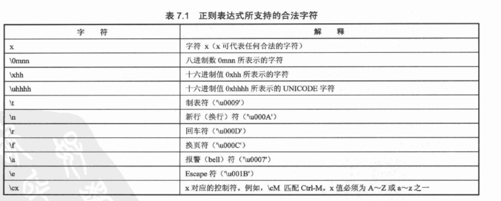
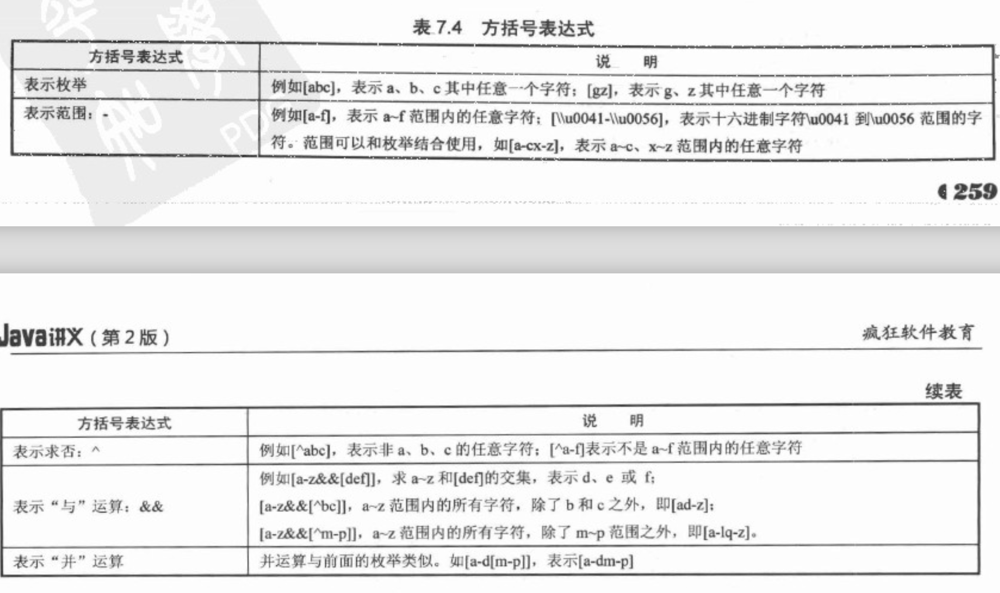

# JAVA学习笔记

## 编译型语言和解释型语言
----
**编译型语言**指使用专门编译器，针对特定平台（操作系统）将源代码一次性翻译成可被该平台硬件执行的机器码。由于编译语言是一次性编译成机器码，所以可以脱离开发环境独立运行，运行起来效率高，但是跨平台性低。常用的：JAVA、C、C++、Pascal等语言（编译语言中java和c其实也有区别）。

**解释型语言**指使用通用的解释器，根据平台的不同将源代码直接解释成机器语言让机器立即执行（并不会产生中间文件，而是直接执行！），解释器是通用的，从而实现解释型语言的跨平台性。解释型语言相当于把编译型语言中的编译和解释过程混合到一起同时完成。

如图：


可以看到**编译型语言**有两种：**第一种**如C++，直接编译成机器可以执行的二进制文件给机器执行；**第二种**如java，先编译成.class文件然后通过JVM解释成二进制文件给机器执行（这也是为什么java比C++要慢一些，因为多了JVM解释的一步，但java也因此可以跨平台）。**解释型语言**通过解释器直接生成机器代码让机器立即执行，因此解释型语言不能脱离解释器独立运行，但是因为解释器使解释型语言可以跨平台运行；可以认为解释型语言每一次运行都会编译一次，因为解释型语言不会产生中间文件（如java .class文件等），而编译型语言可以一次编译多次执行，这也导致解释型语言运行效率比编译型语言要低很多。（现在已经有很多方案来对解释型语言的运行进行优化）

## JAVA是强类型语言
----
java语言是一种强类型语言，即每一个变量和每一个表达式都有一个在编译时就确定的类型。每一个变量都必须先声明类型，才能使用。变量的类型限制了变量所能被赋予的值，限制了这些变量可进行的操作。

java支持数据类型分为两类：

* 基本数据类型：

	* **整数类型**
	* **字符类型**
	* **浮点类型**
	* **布尔类型**

* 引用类型：类、接口、数组类型，引用类型变量其实就是**指针**。（null 是一种特殊的引用类型）

### 字符类型和整数类型
-
* 字符常量必须用单引号，String必须用双引号。
* char类型一共可以表示65535个字符，所以char值可以直接转化为整数类型，范围是0~65535。将一个char变量直接赋予一个int变量，int变量显示的是这个char变量的内容在**字符表中**的值。
* 可以给char变量直接赋予0~65535间的int值，会自动转化成某一个字符，原理跟上面相同。（但不能给char变量直接赋予int变量）

### 浮点类型
-
* float（单精度） 占4字节32位， double（双精度） 占8字节64位。double精度更高，占内存更高。 float类型**默认使用double类型**，要使用单精度float后面需要加f或(float a=5.12f)。
* 只有浮点数才能用科学计数法
* 只有浮点数除以0才能得到正负无穷大。

### 基本类型转换
-
#### 自动类型转换

java中基本类型的自动转化图如下：


	注意：当将任何基本类型的与字符串进行连接运算时，基本类型值将自动转换为字符串类型。

#### 强制类型转换

强制类型转换就是上图的逆转换，因此必须要强制转换。用法:`targetType value1=(targetType)value2`

通常字符串类型不能直接转化为基本数据类型，但是通过基本类型的包装类可以实现转换，(java 8种基本类都提供了包装类)比如：

```
String a="45";
int iValue=Integer.parseInt(a);

```
#### 表达式类型自动提升

当一个表达式包含多个基本类型时，**整个表达式的数据类型将自动提升为最高等级的数据类型**。除法亦然，如果最高等级是int，除出来有小数则小数部分自动被去除。

## 流程控制与数组
----
### Switch分支语句
-
需要注意的一点是case 中可以没有break。switch 语句**只做出一次判断**，因此如果匹配的case没有break就会顺序执行后面case语句中的模块，直到遇到break才会停止。

### for循环语句
-
for循环语句`for(初始化语句;条件判断语句;迭代语句)`,其中只有两个分号是必要的，如果是`for(;;)`则死循环（默认一直为true）。可以看到：

```
int count =2
for(;count<10;){
	...
	count++;
}
```

这种写法就跟while循环非常相像。

### 数组
-
数组也是一种类型，它要求数组中所有元素都是相同的类型（基本类型或引用类型都可以）。定义数组：`type[] name`或`type name[]`推荐使用第一种。

**数组初始化**：数组初始化就是为数组 *分配空间* 和 *赋予初始值*，两者 **缺一不可**！初始化分为两种：

* **静态初始化**：由程序员显示指定初始值`arrayname=new type[]{
 element1,element2,...}`
 
* **动态初始化**：只指定数组的长度，由系统为每个元素设定初始值`arrayname=new type[3]`

	* byte/short/int/long初始为0
	* float/double初始为0.0
	* char为 '\u0000'
	* boolean 为 false
	* 引用类型为 null、

java中其实没有二维数组，虽然可以`type[][] name`来定义，但是实质也是一个一维数组，只不过一维数组中的元素也是引用而已。

### foreach循环
-
java 5后的一种新循环，用来**自动迭代遍历数组或者集合**，用法类似：`for(book:books){}`。循环会自动将每一个books数组的元素赋值给book并执行一次循环。  

	注意，book 只是一个临时变量，所以改变book值并不能影响数组中的值。

## 堆内存和栈内存
----
### 什么是堆和栈
-
当在一段代码块定义一个变量时，Java就在栈中为这个变量分配内存空间，当超过变量的作用域后，Java会自动释放掉为该变量所分配的内存空间，该内存空间可以立即被另作他用。**所以说栈是一个临时的为一个方法服务的内存空间，里面存放方法的参数或者引用对象的变量**   
堆内存用来存放由new创建的对象和数组。在堆中分配的内存，由Java虚拟机的自动垃圾回收器来管理。**堆内存是一个相对稳定的内存空间，为整个程序服务。在堆内存中的对象，只有当没有任何引用变量引用它时，它才会被垃圾回收机制回收。**

### 一个堆栈说明实例：
-
代码：

```
public class test {
	public static void main(String[] args) {
		int[] a={1,2,3};//引用变量a指向一个新的数组
		int[] b=new int[4];//引用变量b指向一个新的数组
		System.out.println("b数组长度："+b.length);
		b=a;//将b指向的数组改到与a相同
		System.out.println("新的b数组长度"+b.length);
	}
}
```   

输出：

```
b数组长度：4
新的b数组长度3
[Finished in 0.8s]
```

改变的并不是引用变量b之前指向数组的长度，而是b指向的对象。**定义并初始化一个数组后，内存中分配了两个空间，一个用于存放数组的引用变量（即栈内存），一个用于存放数组本身（堆内存）**
下面是运行时内存示意图：


刚创建时，b指向第一个数组，a指向第二个数组。


`b=a`之后，引用变量b指向第二个数组，第一个数组没有引用对象引用它，变成了垃圾，等待垃圾回收站来回收它。

	注意：如果初始化了一个引用数组，引用数组中的元素都是引用，那么这个引用数组实体还是存储在**堆内存中的**，引用它的变量存储在栈内存中！

放两张JVM运行时内存图：


## 面向对象
-------------------------
### 定义类
-
* 常见的可以定义3个：构造器、Field(成员变量)、方法。
  * 构造器：创建对象的根本途径，如果不设置java会默认一个构造器。构造器实际上是有返回值的，返回的值就是该类的一个实例。构造器都是通过`new`来调用。

* **修饰符**：`public/protected/private  static final/abstract`,其中`final 和 abstract`互斥，他们可以和`static`组合起来修饰方法。


* **static修饰符**：该关键字可以修饰Field和方法，static修饰的表示它属于这个类本身，而不属于该类的单个实例，例如：`Integer.toString(int a)`,这个toString(int i)方法就是static方法，由该类直接调用而不是Integer类的某一个实例调用。（当然Integer实例也有toString()方法，不过注意：Integer的非static方法没有参数！）  
  不使用static修饰则表示该方法或成员变量属于单个实例。**java中用static修饰的Field可以看成一个全局变量或者方法，作用是在一个类里面实现变量的内容或者方法的共享。static成员不能访问非static成员**


		注意：类的方法和Field都是可以通过类的实例来进行访问的！！！


* 对象的**this引用**：this关键字总是指向调用该方法的对象。根据this位置不同，this作为对象的默认引用有两种形式：
  * 构造器中，引用该构造器正在初始化的对象
  * 在方法中，引用调用该方法的对象（主要作用于一个类中两个不同的方法互相使用，this也可以省略）
`注意：在static修饰的方法中无法使用this关键字，因为static 方法并没有一个确定的实例对象。`
`所以，要在static方法中使用这个类的普通方法，只能new一个对象来调用其中的普通方法。`


### 参数调用
-
* 传入参数是基本类型参数：  
  实参的值不会受方法内部形参改变的影响，因为传入的形参实际上是在方法栈中对实参进行了复制，因此实参是不会改变的。
* 传入参数是引用类型参数：  
  实参的值会所指向的对象会受影响，实参本身指向对象这件事是不会改变的，改变的是指向的这个对象的内容，因为方法内的形参也指向了这个对象，因此对这个对象的修改是有效的。

```
注意：基本数据类型的数值是直接保存在main栈里面的，复制后也是直接保存在方法栈里面的，不存在引用关系，所以不会改变；而引用数据类型本身就是一个指针，因此形参也是指向实参指向的位置，形参复制的仅仅是实参指向目标的引用，所以方法内对形参指向对象的修改实际上也是对实参修改对象的修改。
```

### 形参个数可变方法
-
在java 1.5之后允许定义形参个数可变的方法，在一个形参后面加‘...'三点，表面可以接受多个数值，多个数值将会被当成数组传入方法：

```
 public void test(int i, String...books){}//books将作为数组传入方法中
```
与`public void test(int i,String[] books){}`的区别在于调用方法的时候前一种方法会更简便一些，后一种方法必须要新创建一个字符串数组。

### 方法重载
-
java中确定一个方法有三个要素：

* 调用者，方法所属者，既可以是类也可以是对象
* 方法名，方法的表示符
* 形参列表，调用方法是，系统会根据传入的实参列表匹配

**只有当**一个方法调用者和方法名都相同，形参列表不同时才能是方法重载。（？！对于方法的重载返回值必须相同，形参列表必须不同，描述符如static,public 貌似可以不同)

### 成员变量和局部变量
-


**成员变量**随其所属的类或者实例存在而存在。类Field访问`类.类Field`,实例Field访问`实例.实例Field`,类Field也可以通过实例访问，不过它不属于实例，而属于类`实例.类Field`。

类在第一次加载过之后其类Field就会存储于堆内存当中，当又有一个变量new 了这个类，这个类不会重新加载，其中的类Field也不会发生改变。

**局部变量**在定义的时候并不会分配内存，只有显示地初始化赋值之后才会分配内存。局部变量存放在方法栈中，如果是基本类型数据则跟局部变量一起存储在方法栈；如果是引用类型数据，则方法栈中这个变量存储的是地址。

栈内存中的变量无需垃圾回收，往往是随着方法或代码块的结束而结束。

### 封装和隐藏
-
#### 封装

面向对象的三大特性之一（+继承和多态），封装指**将对象的状态信息隐藏在内部，不允许外部程序直接访问对象内部信息，只能通过对象所提供的方法来实现对对象内部信息的访问和操作**。

封装的目的：将对象的Field和内部实现细节隐藏起来；将方法暴露出来，让方法来对对象进行访问和控制。

好处：

* 隐藏类的细节实现
* 让使用者只能通过方法来访问类，从而在方法中对访问操作进行控制，避免不合法的访问
* 进行数据检查，保证对象信息完整
* 便于维护

实现方法：java访问控制符

#### 访问控制符

三个控制符：private public protected, 以及不加任何符号的控制级别，一共4个级别，由小到大为：
`privrate-->default-->protected-->public`
访问控制级别表:


        | private | default | protected | public
 -------|---------|---------|-----------|--------
同一个类中|  ✔️    |  ✔️     |   ✔️      |  ✔️   
同一个包中|         | ✔️     |   ✔️      |  ✔️
子类中   |         |         |  ✔️       |  ✔️
全局范围类|         |        |            |  ✔️


#### package、import、import static

* java 包机制必须满足两点：①源文件使用package指定包名  ②class文件必须放在对应的路径下

* 父包和子包在逻辑上存在包含关系，但是在使用上则不存在任何关系，父包中的类要使用子包的类必须要使用子包的全名。
为了方便，java引入了`import`来在开头导入一个某个包中一个类或者全部类。

* `import`中的`*`只能代表类不能代表包。

* java 1.5之后有`import static`来导入某个类的静态方法或者静态Field`import static com.Frank...className.fieldName|methodName`

### 深入构造器
-
* 一但定义了构造器，默认的无参构造器就不能使用，可以定义多个构造器（其实就是重载）。
* 调用构造器只能用new来调用，构造器可以包含另一个构造器，但是用new的话会创建一个新实例，因此这种情况的时候可以用`this（）`来调用构造器。

### 类的继承
-
* 继承通过`extends`关键字来实现。
* java一个类只能extend一次，但并不是说java是单继承，实际上java的继承是传递的。
* 子类如果要**重写父类中的方法**，需要遵循“两同两小一大”的原则： 
 * “两同”：方法名和形参列表相同
 * “两小”：子类返回值的类型应该比父类返回值类型更小或者相同；子类抛出的异常类应该比父类小或者相等
 * “一大”：子类方法的访问权限应该比父类大或者相等
* 覆盖方法必须是相同的`static`状态   

#### super限定

当子类覆盖了父类的方法时，使用`super`限定任然可以调用父类实例的方法。`super`也可调用父类的Field。也就是说在子类里面有和父类同名且同参数列表的方法或者同名的Field的话都会发生覆盖，想要访问父类的话就需要用`super`。

`注意：super与this 一样不能出现在static修饰的方法中，他们针对的都是实例对象而不是类。`

#### this与super

在Java中`this`与`super`的用法是非常相像的：  
	①他们都是针对对象而不针对类  
	②`this`是针对类之间方法的互相调用，`super`是用于子类调用父类方法。  
	③`this`用于同一个类中方法局部变量和类Field重载的调用，`super`用于子类和父类中Field重写的调用。

#### 重载和重写区别

重载(overload)和重写(override)的区别在于：重载发生在同一个类多个同名方法之间，而重写发生在父类和子类同名方法之间，两者本身不具有太多的可比性。

	注意：子类和父类之间也可能发生重载，如果子类中定义了一个和父类方法名相同，但是参数列表不同的方法就会发生重载

#### 系统查找子类方法中 a 的顺序

（1）查找该方法中是否有名为a的局部变量  
（2）查找当前类中是否有名为a的Field  
（3）查找该子类直接父类中是否有名为a的Field，依次上溯所有父类，没找到报错

#### 调用父类构造器

方法与在一个类中构造器之间互相调用是一个道理，只是同一个类中构造器互相调用用`this()`，而在子类构造器（只有在子类构造器中才能调用父类构造器）中调用父类构造器则用`super()`。
	
### 多态
-
代码：

```
class BaseClass {
	public int book=6;
	public void base(){
		System.out.println("父类的普通方法");
	}
	public void test(){
		System.out.println("父类被覆盖的方法");
	}
}

public class SubClass extends BaseClass {
	//重新定义一个Field隐藏父类的book
	public String book="轻量级JAVA教程";
	public void test(){
		System.out.println("子类覆盖父类的方法");
	}
	public void sub(){
		System.out.println("子类的普通方法");
	}
	public static void main(String[] args) {
		BaseClass bc=new BaseClass();
		bc.base();
		bc.test();
		System.out.println(bc.book);
		SubClass sc=new SubClass();
		sc.base();
		//输出“子类覆盖父类的方法”，表明父类test方法已经被子类重写了
		sc.test();
		//输出“轻量级JAVA教程”，表明父类Field被子类隐藏了
		System.out.println(sc.book);
		//下面编译时类型和运行时类型不同，发生多态
		BaseClass pc=new SubClass();
		//输出6
		System.out.println(pc.book);
		//输出“子类覆盖父类的方法”
		pc.test();
		//输出“父类的普通方法”
		pc.base();
		//运行出错
		pc.sub();
	}
}
```

前面sc和bc两个引用变量它们的运行时类型和编译时类型完全相同（即`BaseClass()`和`BaseClass`相同），所以调用的方法和Field正常。但是pc的运行时类型是`SubClass`，编译时类型是`BaseClass`，因此就出现了多态。调用`pc.test()`的时候因为`SubClass`类中覆盖了`BaseClass`类中的test方法，因此调用的就是`SubClass`类中的test方法，这就导致了可能出现：**相同类型的变量，调用同一个方法的时候出现不同的行为特征，这就是多态！**

但是`pc.sub()`在编译的时候会出错，虽然pc引用变量中确实包含了`sub`方法，但是`sub()`方法并不在`BaseClass`类中。

**当出现运行时类型和编译时类型不一致时，变量调用一个方法会先去检查编译时类型里面有没有这个方法，没有则出错；如果有这个方法则到运行时类型里面去检查是否有同名且参数列表相同的方法，如果有则调用运行时类型中的方法，如果没有则运行编译时类型中的方法。注意：重写的方法会用运行时状态的，但是重写的变量还是编译时状态的不会变。**

**JAVA允许将子类对象直接赋给父类对象，因为子类对象本身就是一个特殊的父类对象，这种方法叫做“向上转型”，向上转型由系统自动完成。**

### 引用变量的强制类型转换
-
引用变量只能调用它编译时类型的方法，而不能调用它运行时类型的方法，尽管它可能确实包含这种方法，如果要运行它的运行时类型方法则需要将它强制转换成运行时类型。

引用变量的强制转换方法与基本类型相似`(type)variable`,它可以将一个**引用变量类型转换成其子类类型**，但不是万能的，要注意：

* **基本类型之间的转换只能在数值类型之间进行，数值类型指：整数类型、浮点类型、字符类型。数值类型不能和布尔类型转换**
* **引用类型之间的转换必须在具有继承关系的两个关系之间进行，并且想要把一个父类型实例转换成其子类型实例，则这个实例必须在实际意义上(即运行时类型)是子类实例才行。如上面代码实例，BaseClass实例 pc 可以强制转换成SubClass,而BaseClass 实例bc则不能转换成SubClass，因为bc的运行时类型不是SubClass。**

* **多态发生其实也是引用变量的类型转换，总结起来：将子类转换成父类**,`BaseClass bc=new SubClass()` **父类成员变量不变，重叠的方法调用子类的方法；而将父类强制转换成子类**,`SubClass sc=(SubClass)bc`**sc中的变量和方法都来自于子类。**

可以使用`instanceof`判断对象是不是某个类或者这个类的子类，用法：`(testString instanceof String)` ,`instanceof`之前是要判断的对象，之后是判断的类型，正确返回`true`，不正确返回`false`。在这里可以将`instanceof`是一个二元运算符类似`== >`。 在进行强制类型转换的时候可以先用这个运算符判断一下。

### 继承与组合
-

继承带来的高度复用的同时，也破坏了父类的封装性。（子类可以调用父类的Field和方法）因此父类的设计一般遵循如下规则：

* **尽量隐藏父类内部数据。**把所有的Field都设置成private访问类型。
* **不要让子类随意可以访问、修改父类方法。**父类中仅为辅助作用的工具方法，应该使用private访问类型；如果父类允许被外部类调用的方法，必须用public来修饰，但如果不想让子类重写该方法，则要用final修饰符；如果父类希望某个方法被子类重写，但不希望被其他类自由访问，则可以用protected访问类型。
* **尽量不要在父类构造器中调用可以被子类重写的方法。**因为这个时候父类构造器在执行时，调用的是子类重写过的方法，原理跟多态类似（实例在调用方法时，如果有重写的方法，使用优先子类的方法！？）。因此可能引发空指针异常（实例自己查）。
* **如果要把某个类作为最终类（即不能再成为父类），则可以用final来修饰这个类。**如JDK的`java.lang.String`.
* **子类需要添加额外的属性，而不是仅仅是改变属性的值。**
* **子类需要添加自己独有的行为方式。**

#### 利用组合实现复用

对于继承而言，子类可以直接获得父类的public方法，程序访问子类从父类那里继承到的方法；而组合则是把旧对象作为新类的Field嵌入，而实现新类的功能，用户看到的都是新类的方法，而不能看到被嵌入对象的方法。实例:

```
class Aminal{
	private void beat(){
		...
	}
	public void breathe(){
		beat();
	}
}
class Bird{
	//将原来的Aminal嵌入Bird 类，作为Bird的一部分。
	private Aminal a;
	//重新定义Bird的构造器
	public Bird(Animal a){
		this.a=a
	}
	//重新定义一个breathe方法
	public void breathe(){
	//直接复用Animal的breathe方法来实现Bird的breathe方法
	a.breathe();
	}
	//Bird类自己的方法
	public void fly(){
	...
	}
}
```

### 初始化块
-

初始化块是java类里可以出现的第四种成员（Filed,方法，构造器），一个类里面可以有多个初始化块，执行顺序从上到下。语法格式如下：

```
[修饰符]{
	...//初始化块可执行代码
}
```

**初始化模块总是在构造器之前执行,即使初始化模块代码在构造器后面。**

用`static`修饰的初始化块叫做**静态初始化块**，静态初始化块的好处是在类被加载时就直接调用了，而不是如普通初始化块要等到实例被创建时才调用。此外要注意的是：**静态块同样只能初始化static修饰的Field，不能访问非静态Field。**

**无论是初始化模块还是构造器，在创建实例的时候都会先运行追溯到类最顶层的构造器和初始化模块。**

JVM在**第一次**主动使用一个类的时候，在**加载**时会在**准备阶段**为类的静态Field分配内存；在**初始化阶段**则初始化这些静态Field。

### final
-

`final`关键字用来修饰**方法、类、Field**，用`final`修饰的**变量**不允许被**重新赋值**，修饰的**方法**不允许被**子类覆盖**，修饰的**类**不允许派生**子类**。

也就是说，被final修饰的类Field和实例Field在初始化的时候就需要显示地赋值，否则则变成系统默认值无法改变：

1. 类Field:必须在静态初始化模块或者声明该Field的时候就赋值。
2. 实例Field:必须在非晶态初始化模块、声明该Field或者构造器中指定初始值。

**注意**：Java不会对局部变量进行自动初始化，局部变量(形参不是局部变量，会有初值)必须要由程序员显示初始化。因此final修饰的局部变量既可以定义时赋值，也可以在定义的时候不赋值：

```
//实例的一个方法
public void test(){
	//创建一个形参b，b不会有初值，所以合法
	final int b;
	b=6;
}
```

**当用`final`修饰引用变量时**：其本质只是保证这个变量引用的地址不会发生改变，而这个变量的内容是可以发生改变的。这个概念与final修饰的基本数据类型有所出入，但实质其实是一样的，因为引用变量本身也就是一个地址。

**`final`修饰符的一个重要作用就是定义“宏变量”（即直接量）**,f


inal变量（非局部）的初始值在编译时期就能确定下来，这个final变量本质上就是一个宏变量，编译器会把任何用到这个变量的地方直接替换成该变量的值。**对于final实例变量来说，只有在声明时直接赋值才会有宏变量的效果。**

### 不可变类
-

不可变类是创建该类实例之后，该实例的Field是不可变的。Java中8个包装类以及String类都是不可变类。如`String a=new String("a String")`,你无法改变`引用变量a`所指向的String对象的Field值，如果你用`a="another String"`的话，其实是创建了一个新的String对象加入到了常量池中，原来的内容为"a String"的对象依然没有发生改变。

定义不可变类需要的规则：

1. 使用private和final修饰符来修饰该类的Field
2. 提供带参构造器，用于根据传入参数来初始化Field
3. 仅为该类提供`getter()`方法，不要提供`setter()`方法，因为普通方法无法修改final修饰的Field
4. 有必要的话重写`equals()`和`hashcode()`方法

来个例子：

```
public class ImmutableClass{
	//用private和final封装这个类实例的Field
	private final String a;
	//提供一个无参构造器
	public ImmutableClass(){
		this.a="";
	}
	//重载一个有参构造器
	public ImmutableClass(String a){
		this.a=a;
	}
	//提供一个getter()方法
	public String getter(){
		return this.a;
	}
}
```

### 包装类
-

**来源：**java提供了8种基本数据类型，但是基本数据类型不具备“对象”的特征：没有Field、方法可以被调用。因此，所有引用变量都可以当做Object 变量来使用，但是基本数据类型的变量就不可以，因此为了解决这个问题，java提供了包装类（Wrapper Class）的概念。

8个基本数据类型对应的包装类：

基本数据类型| 包装类
----------|------
byte		| Byte
short     | Short
int       | Integer
long      | Long
char      | Charactor
float     | Float
double    | Double
boolean   | Boolean

八个基本数据类型可以直接传入参数来进行包装，也可以通过字符串来进行包装（除了Charactor类）。实例如下：

```
{
//通过传入对应的参数来包装
boolean b1=true;
Boolean B1Obj=new Boolean(b1);
int it=5;
Integer itObj=new Integer(it);
//通过字符串来包装
Float f1=new Float("5.45");
Boolean c1=new Boolean("false");
}
```

**当使用字符串来创建包装类时，如果字符串不能成功转换成对应的基本类型变量，则编译会通过，但会出现**`java.lang.NumberFormatException`**异常。对Boolean对象来说，传入除了"true"和"True"之外的字符串都会变成"false"。**

要获得包装类中的基本数据类型，则可以用包装类的`XXXVlue()`实例方法：

```
boolean b1=b1Obj.booleanValue();
int it=itObj.intValue();

```

**JDK 1.5提供了自动装箱和自动拆箱功能**：自动装箱就是可以把一个基本数据类型变量直接赋值给对应的包装类变量；自动拆箱则反之，一个包装类对象可以直接赋值给与之对应的基本数据变量。

```
{
//把一个基本数据类型直接赋值给包装类对象
Integer itObj=5;
//把一个基本数据类型直接赋值给Object对象，因为Object是所有类的父类
Object b1Obj=true;
//把一个包装类对象直接赋值给基本数据类型变量
int it=itObj;
}
```

**除此之外，包装类还可以实现将字符串转换为基本数据类型**

1. 利用包装类parseXXX(String s)静态方法
2. 利用包装类XXX(String s)构造器

**String类也提供了多个重载的**`valueOf()`**方法，用于将基本数据类型转换成字符串类型**，实例如下：

```
{
String intStr="123";
float aFloat=3.45;
//把特定字符串转换成基本数据类型
int it1=Integer.parseInt(intStr);
int it2=Integer(intStr);
//将基本数据类型转换成字符串
String aString=String.valueOf(aFloat);
}
//还有一种简单的方法
String anString=aFloat+"";
```

**虽然包装类实例是引用数据类型，但是包装类实例也可以跟基本数据类型变量进行直接比较：**

```
Integer aInte=new Integer(6);
if(aInte>=3){
	...
}
```

### 处理对象
-
Java对象都死Object类的实例，都可以调用Object类的方法，这些方法提供了处理Java对象的通用方法。

#### 打印对象和toString方法。

`toString()`方法是Object类的一个方法，其功能是：打印一个对象时，输出该对象的“描述信息”，默认是（类名+@+hashCode）。**当java对象和字符串做连接运算时，java会自动为对象使用toString()方法。**

#### `==`和equal方法

基本数据类型之间可以通过`==`来进行比较判断是否相等，但是对象之间用`==`则只是判断这个引用变量的指向的内存地址是否一样，而不是判断其中的值是否一样。

#### 常量池（Constant Pool）

**常量池**专门用于管理在编译期被确定并保存在一边以的.class文件中的一些数据。它包含了关于类、方法、接口中的常量，也包含字符串的常量。

* 常量：用final修饰的成员变量表示常量，值一旦给定就无法改变。

实例：

```
{
	String a="hello";
	String b="hello";
	String c=new String("hello");
	String d="hel"+"lo";
	String e1="hel";
	String e2="lo";
	String e=e1+e2;
}
```
如图所示：

这是因为，当java使用形如“hello”这样的字符串直接量的时候，JVM将使用常量池来管理这些字符串；当使用`new String("hello")`的时候，JVM会先用常量池来管理“hello”直接量，再为引用变量c创建一个新的String对象，放进堆中。因此`a==b`,常量池一开始先为“hello”字符串分配了空间放在堆中，为了使副本不重复，a和b其实都直接指向了这块内存空间；而`a!=c`使用new String（"hello"）方法则相当于强行再为c在堆中开辟空间来存储这个字符串;`a==d`,因为d是由两个常量连接而成的，在编译的时候就JVM就直接当成是完整的“hello”来处理，所以保存到了常量池中；`a！=e`，因为e是由e1和e2两个引用变量连接成的，两个引用变量有可能会改变，所以在编译的时候并不能确定e的值，所以不能直接指向常量池，要等到运行的时候才知道e的值是“hello”。


**常量池好处**：

1. 常量池中所有字符串常量被合并，只占用一个空间。
2. 比较**字符串**时，==比equal()快。对于两个引用变量来说，用==可以判断指向地址是否相等，如不相等可能再用equal去判断值是否相等。

#### 类成员

`static`修饰的成员就是类成员，类成员可以使Field、方法、初始化模块、内部类（接口、枚举）。`static`不能修饰构造器。

**重要规则**：类成员不能访问实例成员。

#### 单例类

针对需求：一个类只允许有一个实例创建。

实现方法：将类的构造器用private封装起来；提供一个public方法来调用这个构造器（该方法必须是static，因为这个时候还没有实例只能靠类来调用这个方法）；还需要一个变量来缓存已经创建的实例，保证只有一个实例被创建，由于变量会被静态方法调用，因此这个变量也一定是static的。

代码：

```
class Sample{
	//创建缓存变量
	private static Sample instance;
	//封装构造器
	private Sample(){
		...
	}
	//创建一个调用构造器的方法
	public static getInstance(){
		//判断缓存变量是否有值
		if(instance==null){
			instance=new Sample();
		}
		return instance;
	}
	
}
```
### 抽象类
-

**背景**：定义了一个父类，这个父类只知道子类应该有什么样的方法，但是不知道方法是如何实现的，或者不同的子类对这个已知方法有不同的实现方式。如：Shape类是一个父类，它知道其子类应该都有一个`calPeremeter()`方法来计算周长，但是圆和正方形计算方式都不一样，因此需要一个抽象方法来声明，而并不用知道这个方法具体的实现`public abstract int calPeremeter();`。

**为什么不直接在父类中去掉这个方法呢？**

形如之前继承章节中的例子`BaseClass pc=new SubClass();`，父类的引用变量实际引用到的是其子类的实例，那么如果父类中没有这个`calPeremeter()`这个方法，`pc.calPeremeter`将直接报错，要解决只能将这个父类实例强制类型转换。而如果在父类中声明了子类的这个方法的话，子类重写的方法会覆盖掉父类的方法，`pc.calPeremeter()`就可以直接调用而不需要去进行强制转换。
**可以在父类直接用空方法块而不用抽象类么？**

理论上来说是完全可以的，但是为了更好的可读性和可维护性在需要的时候还是用抽象类。在定义一个抽象的的时候其实就是告诉别人这个类不会被创建实例，他的作用就是给子类继承其方法，并且抽象类中的抽象方法一定会被其子类所重写。

**有抽象方法的类必须定义为抽象类，抽象类可以没有抽象方法，规则如下**：

* 抽象类必须用`abstract`来修饰，抽象方法也必须用`abstract`来修饰，**抽象方法不能有方法体。**
* 抽象类不能被实例化，即不能用`new`关键字创建抽象类的实例。
* 抽象类可以包含 Field、方法（普通或者抽象方法）、构造器、初始化块、内部类、枚举类 6种成分。**抽象类的构造器不能创建实例，主要用于被子类调用。**
* 含有抽象方法的类（**直接定义一个抽象方法；继承了一个抽象父类，但没有完全实现抽象父类包含的抽象方法；实现了一个接口，但没有完全实现接口包含的3种情况**）只能被定义为抽象类。
* 抽象类可以继承非抽象的类（接口不能）。

**【重要】**：抽象类不能创建实例指的是不能通过`BaseClass b=new BaseClass()`（BaseClass是个抽象类）来创建`BaseClass`类的实例，但是`BaseClass`类型的引用变量是可以有的，即`BaseClass b=new SubClass()`是合法的。

抽象类实例：

```
abstract class Shape{
//声明一个抽象方法,注意没有方法块
	public abstract double calPeremeter();
	//抽象类构造器
	public Shape(){
		...
	}
}
```

**【重要】：**

* 当使用abstract修饰类时，表明这个类只能被继承；当使用abstract修饰方法时，表明这个方法必须由子类重写。而final修饰的类不能被继承，final修饰的方法不能被重写，因此abstract和final是两个永远互斥的修饰符。
* `abstract`修饰的方法必须被其子类重写才有意义（也一定要重写，不然会报错），因此抽象方法一定不能是`private`的，因此`abstract`和`private`修饰符也互斥。

`abstract`不能修饰Field、变量（局部变量）、以及构造器。

### 接口（interface）
-

**接口**：接口是更特殊的“抽象类”————接口所有方法都是抽象方法。

**接口的定义**：

```
[修饰符] interface 接口名 extends 父接口1，父接口2...
{
	零到多个常量定义
	零到多个抽象方法定义
}
```
* 修饰符只能是pulic或者省略,如果省略则是只能在相同的包下才能访问接口
* 命名规则跟类应该相似
* 接口可以有多个父接口，但接口**只能继承接口**，不能继承类
* 接口是一种规范，因此不**能包含构造器、初始化块；可以包含**Field(只能是常量,系统会自动为其增加`public static final`)**、**方法（只能是抽象方法，系统会自动增加`public abstract`）**、内部类（内部接口、枚举，自动增加`public static`）**
* 因为接口是多各类的公共行为规范，因此接口里面的**Field、方法、内部类都是public**，可以省略

**【重要】**：接口可以被当成一个特殊的类，因此java源文件中最多只有一个public接口（在一个源文件中定义类，只能与文件名同名的类定义才能用public修饰符，接口道理类似），也就是说如果一个源文件中定义了一个public接口，这个文件名必须与接口名相同。

实现接口：

```
[修饰符] class 类名 implements 接口1，接口2...
{
	方法体
}
```

**类继承一个接口与继承一个抽象类同理，必须实现所有抽象方法，否则就定义为抽象类。实现接口的抽象方法时，方法必须是public，因为子类重写访问必须相等或更大。**

#### 接口和抽象类

接口和抽象类都有以下特征：

* 接口和抽象类都不能被实例化，他们都位于继承树的顶端，用于被类继承和实现
* 他们都包含抽象方法，继承的实现子类都必须实现这些抽象方法

但是两者的**设计目的差别非常大**，主要体现在以下：

**接口**体现的是一种规范。对于实现者而言，接口规定了实现者必须向外提供哪些服务；对于接口调用者而言，接口规定了调用者可以调用哪些服务。当在一个程序中使用接口时，接口时多个模块之间的耦合标准；当在多个程序之间使用接口，接口时多个程序的通讯标准。因此对于一个系统来说，接口相当于系统的“总纲”，它制定模块之间的标准，因此系统中接口是不能轻易改变的，一旦改变影响是辐射式的。

**抽象类**作为系统中多个子类的公共父类，体现的是一种模板式的设计。

### 内部类
-

将一个类定义在另一个类里面，则是内部类。内部类有以下好处：

* 内部类提供了更好的封装性，不允许同一个包的其他类访问该类。
* 内部类的成员可以直接访问外部类的私有数据，因为内部类也被当成外部类的成员，同一个类的成员可以互相访问。但是外部类不能访问内部类的实现细节，如内部类的成员变量。

**非静态内部类**：

```
public class OuterClass{
	//此处定义内部类	
}
```

大部分时候，内部类都被作为成员内部类来定义，而不是作为局部内部类。成员内部类对外部类来说是一种与Field、构造器等相似的成员，而局部内部类则不是外部类的成员。成员内部类分为：静态和非静态。

```
class A{}
public class B{}
```
以上例子Class A和Class B是两个**独立的类**，没有谁是内部谁是外部的关系，内部类一定要放在外部类内部定义。

**【重要】**:当在非静态内部类的方法内访问某个变量，系统有限在该**方法内**查找是否存在相同名字的**局部变量（包括形参）**；否则到该**内部类中**查找是否存在相同的**成员变量**；否则到**外部类中**查找是否存在相同的**成员变量**；否则报错。

对于非静态内部类来说，**非静态内部类对象必须寄存在一个外部类对象中**，因为非静态对象不能再外部类的`main`函数中创建，`main`函数是`static`，不能访问非静态的类。因此非静态内部类对象只能在外部类对象的某个方法中被创建出来。

此外，非静态内部类中也**不能定义静态Field、静态方法、静态初始化块**。

**静态内部类**：

`static`的作用是把类的成员变成类相关，而不是实例相关，即`static`修饰的成员属于整个类，而不是属于某个实例。外部类的上一级单元属于包，而内部类的上一级单元属于外部类，因此**外部类不能用`static`修饰，内部类可以**。被修饰的内部类就属于外部类本身，而不属于外部类某个对象。**这时可以在外部类main方法中创建内部类实例，但是外部类依旧不能直接访问内部类的方法和Field等，只能通过创建内部类的对象进行访问。**

**当一个内部类被`static`修饰，可以看成这个类中所有成员都变成`static`了，因此此时的静态内部类不能访问外部类的非静态成员，只能访问静态成员。**


**内部类的用法：**

* 用public修饰的内部类在外部类外使用跟正常类一样，可以在任何地方被使用。
* 用protected修饰的内部类，可以被外部类处于同一个包中的其他类和外部类的子类使用
* 省略（default）修饰的内部类，可以被与外部类处于同一个包的其他类访问
* 用pravite修饰的内部类只能在外部类内使用

**局部内部类**：

把一个类放在方法里面定义，则就是局部内部类，该类仅在方法里有效。因为局部内部类不能在外部类以外的地方使用，所以也没有访问控制符和static修饰了。 

**匿名内部类**：

匿名内部类适合创建那种只需要使用一次的类，创建匿名内部类会立即创建一个该类的实例，这个类定义会立即消失，不能重复使用。
语法：

```
new 父类构造器（实参列表）|实现接口（）{
	//类体部分
}
```
几个规则：

* 匿名内部类最多继承一个父类或实现一个接口，且必须继承一个父类或实现一个接口。
* 匿名类不能是抽象的，因为匿名类会被立即创建实例
* 匿名类不能定义构造器，因为匿名类没有类名

**闭包和回调**：

闭包是一种能被调用的对象，它保存了创建它的作用域信息。回调是允许客户类通过内部类引用来调用其他外部类的方法。

### 枚举类
-

背景：在某些情况下，一个类的对象是有限而且固定的，如季节类，只有四个对象。这种类就是枚举类。
下面是定义的一个Season枚举类：

```
public class Season {
	//每个季节实例name和desc不可变，因此用final修饰
	private final String name;
	private final String desc;
	//直接在内部调用构造器
	public static final Season SPRING=new Season("春天","踏青")；
	public static final Season SUMMER=new Season("夏天","炎热")；
	public static final Season WINTER=new Season("冬天","寒冷")；
	public static final Season FALL=new Season("秋天","落叶");
	public static Season getSeason(int getnum){
		switch(getnum){
			case 1:
				return SPRING;
			case 2:
				return SUMMER;
			case 3:
				return WINTER;
			case 4:
				return FALL;
			default:
				return NULL;
		}
	}
	private Season(String name, String desc){
		this.name=name;
		this.desc=desc;
	}
	public String getName(){
		return name;
	}
	public String getDesc(){
		return desc;
	}
}
```

### 对象与垃圾回收
-

**垃圾回收机制特征：**

* 只回收堆内存中的对象，不回收任何物理资源（如数据库链接、网络IO）
* 程序无法精确控制垃圾回收的运行，垃圾回收会在适当的时候运行。当对象永久性的失去引用对象之后，垃圾回收会在适当的时候回收它。
* 在回收对象之前，垃圾回收机制总会调用对象的`finalize()`方法，该方法可能会让对象复活（从新拥有一个引用），从而导致回收失败。

**对象在内存中的状态：**

* **可达状态**：对象有一个以上的引用
* **可恢复状态：**对象失去所有的引用，他就进入了可恢复状态。这个时候垃圾回收站调用`finalize()`方法，如果这个方法重新给这个对象了一个引用，则是可达状态，否则被清理掉成为不可达状态。
* **不可达状态：**对象失去所有引用，`finalize()`方法没有指定新引用，这个时候进入不可达状态。只有当一个对象变成不可达状态才会被垃圾回收。


#### 强制垃圾回收

两个方法：

1. 调用System类的gc()静态方法，`System.gc()`.
2. 调用Runtime对象的gc()实例方法，`Runtime.getRuntime.gc()`。

**强制垃圾回收也不是立即执行，只是通知系统垃圾回收。只有Runtime和System提供的runFinalization（）方法可以强制调用所有可恢复状态对象的finalize方法。**

`finalize()`方法特点：

* 永远不要主动调用finalize，把它交给垃圾回收去调用
* finalize不是一定会执行的，其执行不确定且透明
* JVM执行finalize时，可能使对象重新变成可达状态
* JVM执行finalize出错不会影响程序继续执行

#### 对象的软引用、弱引用、虚引用

1. **强引用（StringReference）**:最常见的方式，默认都是强引用。对象被一个或一个以上强引用时处于可达状态。
2. **软引用（SoftReference）**:通过SoftReference类实现，当对象只有软引用时，如果内存不足，对象可能会被回收。
3. **弱引用（WeakReference）**:弱引用比软引用级别更低，当垃圾回收机制调用时，不管有没有足够内存，弱引用的对象都会被回收（相当于对象是可恢复状态，但是有引用）。
4. **虚引用（PhantomReference）**:虚引用跟没有引用大致相同，且虚引用必须跟引用队列（ReferenceQueue）联合使用。其作用主要是追踪对象被垃圾回收时的状态。

### JAR(JAVA Archive File)文件
-

JAR文件是一种压缩文件，与ZIP文件兼容，区别在于JAR默认包含一个META-INF/MANIFEST.MF的清单文件。当一个应用程序包含很多类，要给别人使用的时候通常打包成JAR文件，只要别人在环境变量中添加这个JAR包则JVM就可以自动解压这个包，把这个JAR文件变成一个路径。

JAR包好处：

* 安全，可以进行数字签名，只有能够识别的用户才能使用。
* 加快下载速度，下载多个文件需要多次创建http连接，而打包成一个只需要一次。
* 压缩，使文件变小，压缩机制与ZIP完全一样
* 包封装，可以让里面文件依赖统一的类文件
* 可移植性，JAR作为内嵌在JAVA的处理标准，可以在各种平台直接使用。

**可执行JAR包：**把程序打包成可执行JAR包是一种很典型的发布方式，方便客户使用。如果直接发布可执行文件的话，会丧失掉java的跨平台性。具体实现方法自己google。

## 与运行环境交互
---
### 与用户交互的类
-

大部分程序都涉及到与用户交互，包括键盘、鼠标的输入，以及图形界面的接口（GUI）。

#### 运行java程序的参数

main方法的方法签名：

`public static void main(String[] args){}`

**public修饰符**：Java类由JVM调用，为了让JVM更好的调用，因此用public把main方法暴露出来。
**static修饰符**:JVM直接通过该类来调用主方法，不会通过创建对象来调用，所以用static修饰。
**void返回值**：因为方法由JVM调用，返回任何值给JVM没有意义，所以用void修饰。
**字符串形参**：java是谁调用方法，谁负责为形参赋值。因此args参数由JVM赋值。

#### 使用Scanner获得键盘输入

Scanner类是java.util.Scanner下的，它可以很方便的一个基于正则表达式的文本扫描器，它可以从文件、输入流、字符串中很方便地解析出基本数字类型和字符串类型。

两个主要方法扫描输入：

* `hasNextXxx()`：判断是否有下一个Xxx
* `nextXxx()`:下一个Xxx的内容
* `hasNextLine()`:下一列
* `nextLine()`:同理

### 系统相关类
-

Java提供System和Runtime类来与运行平台（系统）进行交互。

#### System类

System类代表当前Java程序的运行平台，程序不能创建System类实例，System类提供一些类Field和类方法。

**System类提供了代表标准输入、标准输出和错误输出的类Field。并提供了访问环境变量、系统属性、加载文件和动态链接的静态方法**。`System.in`标准输入（通常是键盘）、`System.out`标准输出（通常是显示器）、`System.err`错误输出流，并提供了setIn、setOut、setErr方法来改变标准流。

#### Runtime类

Runtime类代表的是程序的运行时环境，内个Java程序都有一个与之对应的Runtime实例，程序不能创建Runtime实例，但是可以通过`getRuntime()`方法获取当前的实例。**Runtime可以访问JVM的相关信息，如内存、处理器数量等。**

==### 常用类==
-

#### Object类

Object类是所有类、数组的父类，因此允许把任何类型的对象赋值给Object类型的变量。**当一个类没有显示定义父类，就默认继承Object类。**

常用的Object对象方法：

* boolean equals（Object obj），判断是否是同一个对象。这个基本没有实用价值，还不如`==`,很多对象中equals方法都会被重写，如String方法，重写后只是比较内容是否相等，不在乎是否同对象。
* protected void finalize(), 垃圾回收，不能直接调用。
* Class<?> getClass(),返回对象的运行时类。
* int hashCoed(),返回对象hash值，该值由对象地址算出。
* String toString(),返回对象的字符串表示。当用**`System.out.println()`**或者把**对象与字符串做连接运算**时会自动调用。
* 此外还有`wait(),notify(),notifyAll()`等方法，来控制线程
* clone()方法，只是简单复制实例的基本变量，引用变量的复制依旧指向的是同一个地址，因此clone方法实现的只是“简单”复制。

#### Objects类

Java7 新的工具类，主要是对于空指针安全的。当变量为空指针时，Object的toString方法将报错，而Objects.toString则会输出null。此外Objects还提供了判断是否为空指针的方法。

#### String、StringBuffer、StringBuilder类

**String类**是不可变类，String对象内部字符序列不可改变。
**StringBuffer类**是可变类，提供了append(),insert()等方法改变字符串序列，生成期望的字符串后直接用toString()方法转换成String。
**StringBuilder**与StringBuffer类似，后者是线程安全的，前者没有，因此前者性能略高一些。优先考虑使用StringBuilder。

#### Math类

用于更复杂计算的一个类，构造器为private。

#### ThreadLocalRandom与Random类

Random是生成伪随机数的一个工具类，ThreadLocalRandom在多线程并行环境下比Random效率更高。用法都相似，创建一个对象之后用`nextXxx()`方法产生不同类型的随机数。

创建对象的时候有种子这个东西，即`Random r=new Random(1)`,1就是种子，相同种子的两个Random对象以同样的顺序调用方法产生的结果是一样的。当没有种子的时候则种子是随机的。

#### BigDecimal类

用于更精确计算浮点数。

### 处理日期的类
-

#### Date类

Java1开始出现的老类，不适用了，对日期时间处理用Calendar类。

#### Calendar类

Calendar类本身是一个抽象的类，因为记时间的方式太多，所以Calendar类成为了日期的模板，不能直接用new创建对象。（但是可以用`Calendar.getInstance()`创建一个默认的对象）。

Date类和Calendar类都是表示日期的工具，可以互相转换。

注意：add和roll有所不同，两者都是改变某一个field上的值，但是roll改变值超过其限定后，其更大的值不会改变，add则会改变。（例如：8月31日，add(DAY,3)就变成9月3日；roll(DAY,3)则是8月3日）。

Calendar.MONTH是从0开始，其他都是从1开始。所有field(年（YEAR）、月(MONTH)、日（DAY））都可以通过静态访问。

setLenient()方法来改变容错性，默认开启。关闭则不允许设置参数超过限定值。

**set方法延迟修改：**set(filed,VALUE)修改，field值会修改，但是Calendar所代表的时间不会立即修改（也就是day因为月份不同超出限定不会立即被计算），直到下次调用get()、set()等才会重新计算Calendar时间。这是为了防止多次set造成不必要的计算。

#### TimeZone类

地球被划分为24个时区，TimeZonw就代表了时区。

TimeZone是一个**抽象类**，可以用静态方法getDefault()和getTimeZone()得到TimeZone实例，前者获得机器上默认的时区，后者根据时区的ID获取对应的时区。

==### 正则表达式==
-



上述为一些合法的字符，有一些特殊的字符有特殊的含义，需要用这些字符则需要转义：


通配符可以匹配多个字符的特殊字符：


方括号表达式：



边界标识符：


三种模式:

==**Greedy（贪婪模式）：**==数量标识符默认采用贪婪模式，贪婪模式会一直匹配到无法匹配为止。

==**Reluctant(勉强模式)：**==用问号（？）后缀表示，它只会匹配最少的字符。

==**Possesive（占有模式）：**==用加号（+）后缀表示，目前只有Java支持。


#### 使用正则表达式

一旦定义了正则表达式，则可以使用Pattern和Matcher对象来使用。

Pattern对象是正则表达式在内存中的表现形式，因此正则表达式需要**先被编译为Pattern对象**，然后利用该对象**创建对应的Matcher对象**，执行匹配涉及到的方法在Matcher中。
典型顺序：

```
//将一个字符串编译成Pattern对象
Pattern p=Pattern.compile("a*b");
//使用Pattern创建Matcher对象
Mathcer m=p.Matcher("aaabbbb");
boolean b=m,matches();//返回true
```

如果只使用一次匹配则`Pattern.Matcher("a*b","aaaaabbb")`等效前面三句。

**Pattern是不可变类，因此多个并发线程可以安全使用。**

## Java集合
---

Java集合类是用于存储数量不等的多个对象，可以实现常用的数据结构，如栈、队列等。并且Java集合还可以保存具有映射关系的关联数组。Java集合大致分为Set、List、Map三大体系（它们都是接口），**Set代表无序、不可重复的集合**；**List代表有序、可以重复的集合**；**Map代表具有映射关系的集合**。Java 5之后多了一种**Queue代表队列关系的集合。**

### Java集合综述
--

集合是用来保存**数量可变的对象**，因为数组初始化之后长度就固定了，因此集合也被称为==**容器类**==。

**集合只能保存对象不能保存基本数据类型。（实际上的引用变量，习惯上称对象）**

集合主要由**==Collection==**和**==Map==**两个接口派生而成，其中**Collection**派生**Set、Queue、List**，**Map**派生**Map**。

**Map**保存的每一项数据都是`key-value`对，key值是不可重复的，通常根据key值查询其对应value。

Set集合像一个罐子，放入的对象无法记住其顺序；List集合非常像一个数组，它可以记住每次添加对象的顺序；Map也像一个罐子，不能记住顺序，但里面保存的都是key-value对：


### Collection和Iterator接口
-

Collection接口作为3个集合接口的父接口，定义了如下操作集合方法：

* boolean add(Object o)
* boolean addAll(Collection c) 将一个集合c添加到指定集合
* void clear() 清楚集合所有元素
* boolean contains(Object o) 返回集合中是否包含指定集合
* boolean containsAll(Collection c)
* boolean isEmpty()
* Interator iterator() 返回一个Iterator对象，用于变量集合元素
* boolean remove(Object o) 删除指定对象，多个会一起删除
* boolean removeAll(Coleection c)
* Object[] toArray() 将集合转换成一个数组

实例代码：

```
import java.util.*;
public class RandomTest {
	public static void main(String[] args) {
	//create a Set with ArrayList type
	Collection c=new ArrayList();
	//add element
	c.add("Frank");
	c.add("Esther");
	c.add("Father");
	c.remove("Esther");
	Collection b=new HashSet();
	b.add("Frank");
	b.add("Mum");
	//make an subrection operation
	c.removeAll(b);
	System.out.println("what remains in c :"+c);
	b.retainAll(c);
	System.out.println("what remains in b :"+b);

	}
}

```

**其中c的实现类是ArrayList，b的实现类是HashSet，把他们都当成Collection使用时，使用add等操作没有任何区别。**

**所有Collection类都==重写了toString方法==，所以可以直接把集合内容输出出来。**

