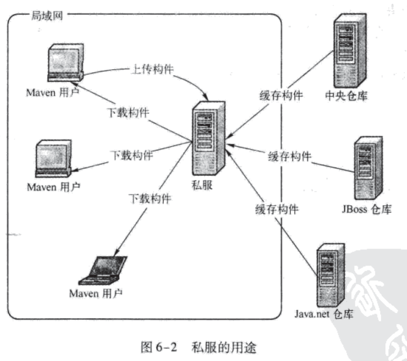

# MVN learn book   
## 静态语言编译  

code--compile-->.bin （c,c++,etc)  
code--compile-->.class--JVM-->.bin (java)  

* 只有.bin这个二进制文件才是机器可以识别的.  
* 静态语言分为中间解释型语言（java,.net)和编译型语言(c,c++)，java通过JVM来对编译出来的二进制.class文件根据运行平台不同(windows/linux)进行翻译，以实现跨平台。

## 测试
* **黑盒测试**：由专业测试人员测试，他们并不关心代码实现或者代码结构，单纯地对软件功能进行测试。
* **白盒测试**：由程序开发人员进行测试，他们了解底层代码结构，有针对性地对软件进测试。白盒测试又分为两种：  
  * 单元测试（常用Junit）：在java中指对一个类的测试，在C中指对一个函数的测试。
  * 集中测试：对多个类所组成的功能模块进行测试。

## 什么是依赖

依赖的实质就是Java中的jar包导入。通过POM文件规定依赖可以让项目在构建的时候自动地到仓库中去下载jar包，这样别人在开发或者使用这个工程的时候就不需要手动去下载或者拷贝工程依赖的jar包，并且也能保证在协同开发中jar包版本的一致性。

## MVN核心理念

在笔者看来，MVN最核心的东西就是通过POM.xml文件对依赖和插件进行版本控制，保证在协同开发的过程中各个开发人员都能在相同版本的jar包和插件上去进行开发，保证了项目开发的一致性。同时通过约定的规范来保证不同开发者之间的交流。

## MVN五大特性
* 依赖注入
* 生命周期
* 插件配置
* 坐标，仓库
* 聚合与继承

## MVN生命周期
 * 几个主要生命周期：
   * process-resource
   * compile
   * process-test-resource
   * test-compile
   * test
   * package 
   * install
   * deploy
 * 每一个阶段都可以绑定多个插件目标，这些阶段本身是不做事情的，事情都交给插件去做。
 * MVN一共有23个阶段，几乎每个主阶段都有before、after两个阶段（可以看做子阶段）来提供预处理和处理后的插件接口，这是MVN扩展性强大的地方。
 * MVN一共有3套生命周期:
   1. clean:
     * pre-clean
     * clean(default: maven-clean-plugin:clean)
     * post-clean
   2. default: 就是上面几个主要周期
   3. site:
     * pre-site
     * site(default:maven-site-plugin:site)
     * post-site
     * site-deploy(default:maven-site-plugin:deploy)  
 
 主要阶段都有默认插件，用户也可以根绝自己需求进行配置。
 
##  MVN插件配置
* 几个标签：
  * `<groupId><artifactId><version>`三个标签来定义插件坐标
  * `<execution>`为插件配置一个任务，其下
  	 * `<id>`标签定义任务名称
  	 * `<phase>`标签指定任务绑定的生命周期
  	 * `<goals>`标签指定任务使用插件的目标
  	 * `<configuration>`表示特定任务的配置
  * `<configuration>`标签如果在`<execution>`标签外面则表示插件式全局配置。

实例：

```
<plugins>  
	<plugin>
  		<groupId>...</groupId>
  		<artifactId>...</artifactId>
  		<version>...</version>
  		<executions>
  			<excution>
  				<id>ant-validate</id>
  				<phase>validate</phase>
  				<goals>
  					<goal>run</goal>
  				</goals>
  				<configuration>
  					<echo>I'm bound to validate</echo>
  				</configuration>
  			</excution>
  		</executions>
  	</plugin>
</plugins>
```

## MVN聚合

**场景：**例如在开发过程中分别实现了注册用户两个功能模块（account-email和account-persist），这个时候会希望能够一次构建两个模块，而不是对两个模块分别用mvn命令进行构建。

因此MVN提供了聚合这个功能，通过创建一个额外的模块（如：account-aggregator)来包含这两个模块，这个‘aa’模块实际上是一个空模块，只有一个pom文件进行配置，没有别的功能，pom配置比较特殊，实例如下：

```
<project ...>
	<modelVersion>...</modelVersion>
	<groupId>...</groupId>
  	<artifactId>...</artifactId>
  	<version>...</version>
  	<packaging>pom</packaging>
  	<name>Account Aggregator</name>
  	<modules>
		<module>account-email</module>
		<module>account-persist</module>
	</modules>
</project>
```
**说明：** 

  * 一般`<packaging>`都是用jar或者war，但是作为聚合，这里必须使用pom，其实只要是父模块不是叶子模块就必须打包成`pom`。
  * `<module>`指定要聚合的模块，使用的是当前模块的相对路径
  * `<name>`标签可以在构建的时候更清晰地输出信息 

## MVN继承
**场景：**开发的过程中很多模块可能会用到相同的`pom`配置，因此导致在项目构建中出现很多重复的配置信息，而事实告诉我们重复越多在修改的过程中越容易出现问题；并且不同的模块由不同的人去开发，所用到的一些依赖版本很容易出现不一致而导致运行冲突，因此MVN提供了继承来解决这个问题。

继承类似于聚合，也是需要建立一个只包含`pom`文件的空模块（如：account-parent），而后通过设置子模块（account-email）中的`<parent>`标签来使子模块继承父模块。可以继承的东西有很多，如**依赖、版本号、groupId、插件等**。 account-email实例如下：

```
<parent>
	<groupId>...</groupId>
	<artifactId>...</artifactId>
	<version>...</version>
	<relativePath>../account-parent/pom.xml</relativePath>
</parent>

```

**说明：**

* `<relativePath>`标签指定继承`pom`的相对路径，默认会子模块上一级文件夹里去找，没指定或者没找到的话则到本地仓库中去找。

## MVN 继承方式

你会发现**继承模块**和**聚合模块**是很相似的两个模块，其实这两个东西是可以通用的，也就是说一个父模块既可以聚合，同时也能作为子模块的依赖，这就是目前很多Spring项目用到的`Bom+Dependecy`方法。

`Bom`可以理解成针对某个特定任务或者框架所需要用到的第三方依赖包，在父模块`pom`文件中直接`import`这个`Bom`包就可以使继承它的所有子模块使用其中的依赖关系（只是依赖，并不继承插件，方式类似于文本替换）。`Bom`的加载实例如下：

```
<dependencyManagement>
    <dependencies>
        <dependency>
            <groupId>org.springframework</groupId>
            <artifactId>spring-framework-bom</artifactId>
            <version>4.0.1.RELEASE</version>
            <type>pom</type>
            <scope>import</scope>
        </dependency>
    </dependencies>
</dependencyManagement>
```

MVN的聚合和继承变化很灵活，下图演示两种常用使用方法：


第一种`Aggre only`模块只负责聚合，子模块不会去继承`Agree only`模块中的依赖和插件等，所有的子模块依赖和插件全部放到`Account-parent`模块里面，通过<parent>标签所有子模块继承这个模块。

第二种`Inh+Aggre`模块既负责聚合子模块，又将一些第三方`bom`依赖集成到了这个模块中，并且在自己的`pom`中可以设置一些通用的插件，子模块利用`<parent>`标签来继承这些依赖和插件。此外还有一个后缀为`dependences`的子模块（跟`Account-parent`模块类似），用来定义子模块中的专用依赖和插件。

子模块只能有一个`<parent>`继承，那么如何导入`denpendence`模块中的依赖和插件呢？其方法跟`Bom`的导入方法类似，可以将`dependence`模块当做一个`Bom`import到子模块中。

## 依赖和插件管理

### 依赖管理

通过`<dependencyManagement>`这个标签可以灵活控制子模块对于父模块依赖的继承（与上面依赖导入有多不同），代码如下：

```
<dependencyManagement>
	<dependencies>
		<dependence>
			 <groupId>org.springframework</groupId>
             <artifactId>spring-framework-bom</artifactId>
             <version>4.0.1.RELEASE</version>
		</dependence>
	</dependencies>
</dependencyManagement>
```

可以看到里面并没有与上面导入依赖集的区别。有些子模块可能并不需要引用到父模块中的所有依赖，因此这种定义方式保证了依赖引用足够的灵活性，**他既不会将定义的这些依赖引入父模块中，也不会传递到子模块中**。只有在子模块声明`<dependenyManagement>`里面的某一个依赖的时候，这个依赖的配置才会引入到子模块中，如：

```
<dependence>
	<groupId>org.springframework</groupId>
    <artifactId>spring-framework-bom</artifactId>
</dependence>
```

可以注意到子模块中并不需要声明`<version>`，因为`org.springframework`的版本会从父模块那儿继承过来，因此依赖管理的好处有两点：

* 避免子模块去继承不必要的依赖
* 可以通过父模块统一控制子模块引用依赖的版本号（虽然并不会在代码量上有所优化）

### 插件管理

类似的，有依赖管理也就有插件管理`<pluginManagement>`标签，这个标签与`<dependencyManagement>`作用类似，是为了统一地管理子模块插件的版本号以及一些如`<encoding>`之类的插件配置。实例代码自行脑补。

## 反应堆

**反应堆（Reactor）**指所有模块组成的构建顺序（单模块反应堆就是其本身）。
**反应堆构建顺序：**MVN按顺序读取POM，如果该POM没有依赖模块则构建该模块，如果有依赖模块则先构建其依赖模块，如果该依赖模块还有依赖，则进一步先构建依赖的依赖。

## 私服

私服是一种特殊的远程仓库，它是架设在局域网内的仓库服务，私服代理广域网上的远程仓库，供局域网内的MVN用户使用。私服的示例图如下：



私服好处有这么几点：

* **节省自己的外网带宽：**大量重复的请求会消耗很大的带宽，利用私服代理外部仓库可以缓解带宽压力。
* **加速Maven构建：**不停建立外部仓库链接是十分耗时的，但是MVN一些内部机制（如检查快照更新）要求不断访问外部仓库。因此利用私服可以让构建速度大大提高。
* **部署第三方构件：**当某个构件无法从任何外部仓库获得的时候（可能是版权原因，也可能是公司内部自己写的构件），利用私服就可以让局域网内所有MVN用户使用这个构件。
* **提高稳定性，增强控制：**MVN的构建依赖于外部仓库的访问，当网络不稳定的时候可能会导致构建失败，因此使用私服可以提高工程构建的稳定性，因为大量的构件会被缓存到私服中。同时一些私服软件（如Nexus）还提供权限管理等。
* **降低中央仓库的负荷**

## 远程仓库验证

大部分远程仓库不需要验证，但是有些远程仓库（如私服等），为了防止非法的访问，管理员会为每个**仓库**提供一组用户名和密码。MVN用户要访问该仓库就需要在自己的`.setting.xml`文件中进行配置，代码如下：

```
<servers>
	<server>
		<id>my-proj</id>
		<username>repo-username</username>
		<password>repo-password</password>
	</server>
</servers>
```
来进行配置，`<id>`元素是关键，其值必须与`Pom`文件中配置的需要验证的`<repository>`元素值一致。


